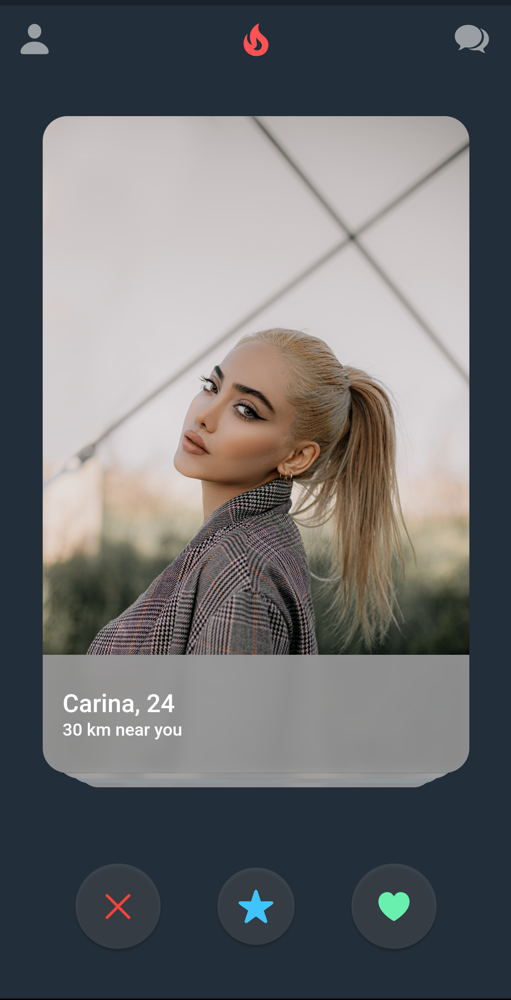

# flutter_tinder_demo

Flutter tinder ui demo.

## Screenshots

 
 

## UI reference
https://dribbble.com/shots/13092764-Dating

## Reference
Thanks to <a href='https://www.youtube.com/watch?v=9dHiV9SYidE&t=56s'>this tutorial</a>  for swiping card .
